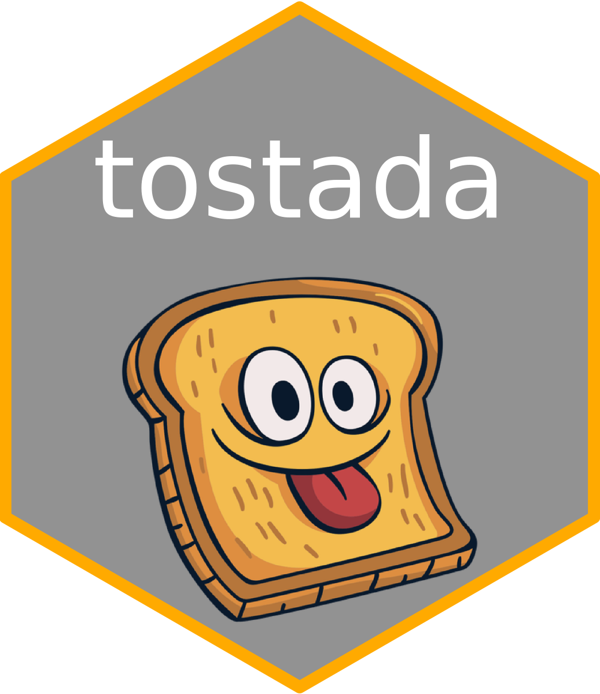

 
<!-- README.md is generated from README.Rmd. Please edit that file -->

# TOolkit for Stellar Asteroseismic Data Analysis

<!-- badges: start -->

# 

<!-- badges: end -->

The goal of tostada is to provide a set of useful functions to deal with
the most standard asteroseismic data (observation files, models, etc.)
as well as frequent operations on these data (e.g. compute large
separations from spectra)

## Installation

You can install the development version of tostada from
[GitHub](https://github.com/) with:

``` r
# install.packages("devtools")
devtools::install_github("juancasy/tostada")
```

## Example

This is a basic example which shows you how to solve a common problem:

``` r
library(tostada)
## basic example code
tostada::constants
#>        a_rad           gk      pi4       smass    sradius      slum
#> 1 7.5657e-15 6.671682e-08 12.56637 1.98919e+33 6.9599e+10 3.846e+33
#>        stefbol     srho    sdynt
#> 1 0.0003021981 1.408571 1593.855
```

<!-- You'll still need to render `README.Rmd` regularly, to keep `README.md` up-to-date. `devtools::build_readme()` is handy for this. You could also use GitHub Actions to re-render `README.Rmd` every time you push. An example workflow can be found here: <https://github.com/r-lib/actions/tree/v1/examples>. -->
<!-- You can also embed plots, for example: -->
<!-- ```{r pressure, echo = FALSE} -->
<!-- plot(pressure) -->
<!-- ``` -->
<!-- In that case, don't forget to commit and push the resulting figure files, so they display on GitHub and CRAN. -->
